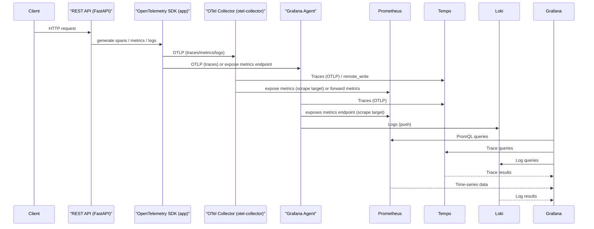

# FastAPI Sample Application

This is a sample FastAPI application that demonstrates how to create a simple web server with API endpoints.

## Project Structure

```
fastapi-sample-app
├── app
│   ├── main.py          # Entry point of the FastAPI application with opentelemetry output
│   ├── api
│   │   └── endpoints.py # API endpoints definition
│   └── models
│       └── __init__.py  # Data models (currently empty)
├── requirements.txt     # Project dependencies
└── README.md            # Project documentation
```

## Requirements

To run this application, you need to have Python installed. You can install the required dependencies using pip:

```bash
pip install -r requirements.txt
```

## Running the Application

To start the FastAPI server, run the following command:

```bash
uvicorn app.main:app --reload
```

This will start the server in development mode, and you can access the API at `http://127.0.0.1:8000`.

## API Endpoints

The application includes a sample endpoint that returns a greeting message. You can access it at:

```
GET /greet
```

This endpoint will return a JSON response with a greeting message.


## Tempo vs Jaeger

Tempo and Jaeger are two popular backends for storing and querying distributed traces. Briefly:

- **Tempo** (Grafana Tempo)
    - Maintained by Grafana Labs.
    - Designed for large-scale, cost-efficient trace storage using object stores (S3, GCS, or local).
    - Integrates tightly with Grafana for trace visualization and linking from metrics and logs.
    - Easy to operate in a Grafana-centric observability stack.

- **Jaeger**
    - Originally developed by Uber, now a CNCF project.
    - Provides its own UI, and supports backends like Elasticsearch or Cassandra for storage.
    - Mature ecosystem and rich feature set for trace sampling, storage and querying.

Both support OTLP ingestion from the OpenTelemetry Collector.

## Do you need tracing (Tempo/Jaeger)?

Consider adding a tracing backend (Tempo or Jaeger) if any of the following apply:

- You run a distributed system or multiple microservices and need to follow requests across services.
- You want to diagnose latency hotspots and see time spent in each service/span.
- You need causal context to correlate metrics and logs with traces for debugging.

You can skip adding Tempo/Jaeger if your needs are limited to:

- Basic metrics collection and alerting (Prometheus + Grafana).
- Application logging (Loki or other log backends) without distributed request flow analysis.

In short: tracing is optional but highly recommended for multi-service environments where end-to-end request visibility matters.


## Design decisions

- Grafana Agent (grafana/agent) was chosen for this sample Raspberry Pi deployment because it's lightweight, easy to configure, and integrates well with Grafana, Loki and Tempo. It can receive OTLP traces and forward them to Tempo, push logs to Loki, and expose metrics for Prometheus scraping.
- Note: Grafana Agent does not always implement the full OTLP gRPC Metrics service. In this setup traces are sent via OTLP gRPC to the agent (which works), but OTLP metrics via gRPC may return UNIMPLEMENTED. Two options:
  1. Use the OTLP HTTP metrics exporter from your app (POST /v1/metrics to the agent's HTTP receiver).
  2. Run a full OpenTelemetry Collector (otel-collector-contrib) which implements the OTLP gRPC Metrics service.
- Important: the upstream otel/opentelemetry-collector-contrib image does not include a Loki exporter, so the sample otel-collector configuration was updated to remove the unsupported "loki" exporter. If you need to push logs to Loki, either:
  - Use Grafana Agent (which includes a Loki client) to forward logs to Loki, or
  - Push logs from your application directly to Loki's HTTP push API.
  This avoids collector startup failures caused by unsupported exporter types.


## OpenTelemetry, Prometheus, and Grafana Sequence Flow


## License

This project is licensed under the MIT License.